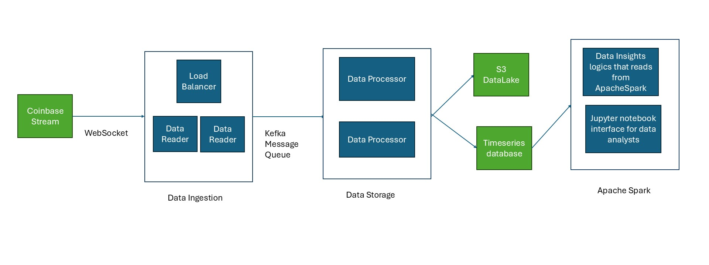

# High-Level Cloud Architecture Design
# Core cloud design
emphasizing fault tolerance, scalability, and storage.

AWS or Azure 

TODO: Add cost comparison

# Deploying on our own private servers

TODO: Add open source tools that does the same. 
Inspired by DHH's decloud post.

For a company of size Kahoot running your own services on your own data centers or renting a bare metal servers can also be a cheaper alternative since there is an estalblished revenue stream and the system load is somewhat predictable. 

TODO: Add cost comparison and tools